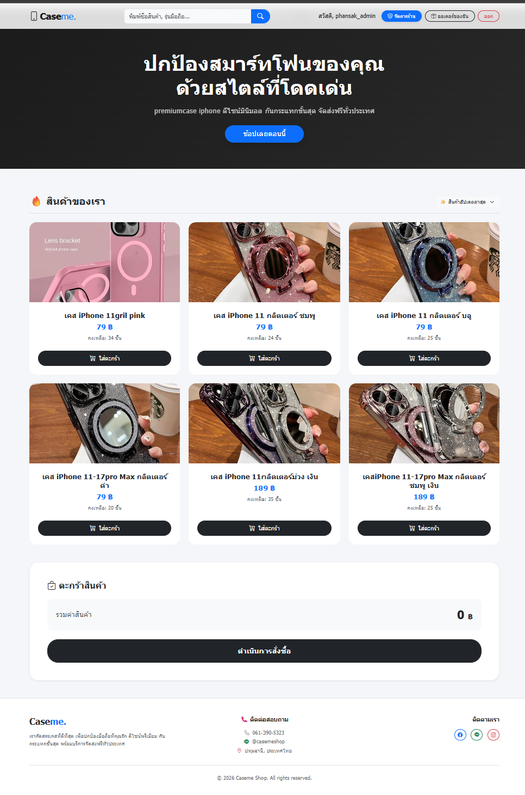
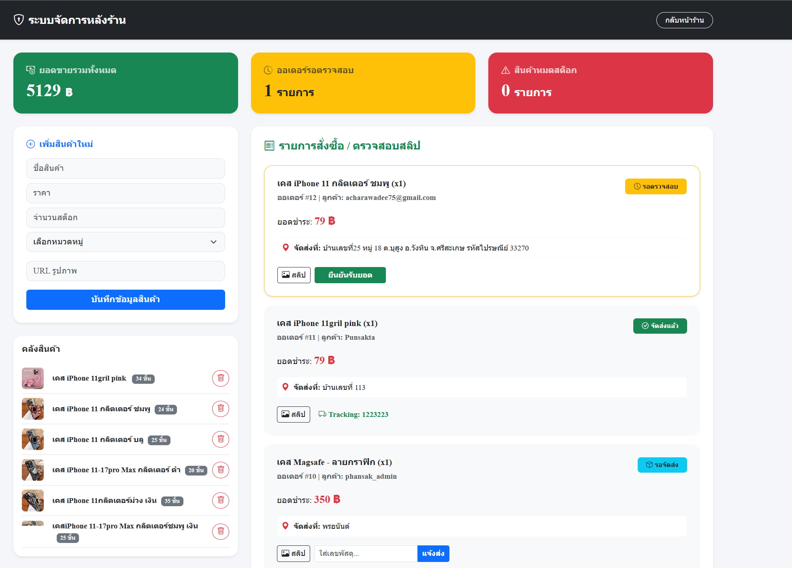

<div align="center">

# 🛒 Caseme Shop

### Full Stack E-Commerce Web Application

A modern full-stack E-Commerce website developed with **Node.js**, **Express.js**, **MySQL**, and **Bootstrap**.

[]()
[]()
[]()
[]()
[]()

🌐 **Live Demo**

https://caseme-shop.onrender.com

📂 **GitHub Repository**

https://github.com/punsak1998/caseme-shop

</div>

---

# 📖 Project Overview

**Caseme Shop** is a Full Stack E-Commerce web application developed to simulate a real online shopping platform.

The system includes customer shopping, secure authentication, inventory management, product image upload, order processing, shipping tracking, and an administrative dashboard.

This project demonstrates practical experience in backend development, database design, authentication, CRUD operations, and deployment.

---

# 📸 Screenshots

## 🛍 Customer Website



---

## ⚙️ Admin Dashboard



---

# ✨ Features

## 👤 Customer

- User Registration
- Secure Login (bcrypt)
- Product Search
- Shopping Cart
- Checkout
- Order History
- Responsive Design

---

## 👨‍💼 Admin

- Dashboard
- Add Product
- Edit Product
- Delete Product
- Upload Product Images
- Inventory Management
- Order Management
- Order Confirmation
- Shipping Tracking Number
- Sales Summary

---

# 🛠 Tech Stack

| Category | Technology |
|----------|------------|
| Frontend | HTML5, CSS3, Bootstrap 5, JavaScript |
| Backend | Node.js, Express.js |
| Database | MySQL |
| Authentication | bcrypt |
| File Upload | Multer |
| Version Control | Git & GitHub |
| Deployment | Render |

---

# 🏗 System Architecture

```text
                Browser
                   │
                   ▼
        HTML + Bootstrap + JavaScript
                   │
                   ▼
             Express.js Server
          ┌────────┴────────┐
          ▼                 ▼
 Authentication        Product API
          │                 │
          └────────┬────────┘
                   ▼
              MySQL Database
                   │
                   ▼
             Uploaded Images
```

---

# 🗄 Database

Main database tables:

- Users
- Products
- Orders
- Order Items

The database is designed using relational principles to ensure consistency and reduce redundancy.

---

# 📂 Project Structure

```text
caseme-shop/
│
├── assets/
│   ├── home.png
│   └── admin.png
│
├── uploads/
├── node_modules/
├── database.db
├── server.js
├── package.json
├── package-lock.json
└── README.md
```

---

# 🚀 Installation

### Clone Repository

```bash
git clone https://github.com/punsak1998/caseme-shop.git
```

### Enter Project

```bash
cd caseme-shop
```

### Install Dependencies

```bash
npm install
```

### Start Server

```bash
npm start
```

Open your browser

```text
http://localhost:3000
```

---

# 🔌 Main API

| Method | Endpoint | Description |
|---------|----------|-------------|
| POST | /api/register | Register User |
| POST | /api/login | User Login |
| GET | /api/products | Product List |
| POST | /api/orders | Create Order |
| POST | /api/upload | Upload Product Image |

---

# 📈 Future Improvements

- JWT Authentication
- Payment Gateway
- Email Notification
- Product Categories
- Sales Analytics Dashboard
- Export Excel Report
- Docker Deployment
- Unit Testing
- REST API Documentation

---

# 🎯 Learning Outcomes

This project demonstrates practical experience in:

- Full Stack Web Development
- REST API Development
- CRUD Operations
- Authentication & Authorization
- Database Design
- Inventory Management
- Business Workflow Implementation
- File Upload Management
- Git Version Control
- Deployment on Render

---

# 👨‍💻 Author

## Phansak Thapthimhin

🎓 Business Computer Student

💻 Junior Full Stack Developer

📧 Email

Punsak1998@gmail.com

🌐 GitHub

https://github.com/punsak1998

🚀 Live Demo

https://caseme-shop.onrender.com

---

⭐ **If you like this project, don't forget to give it a Star on GitHub!**